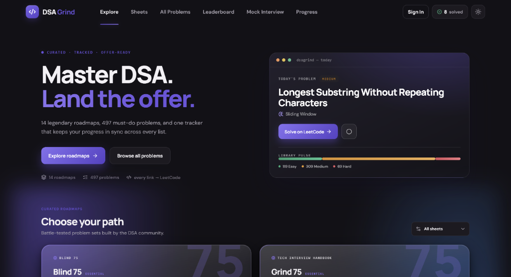
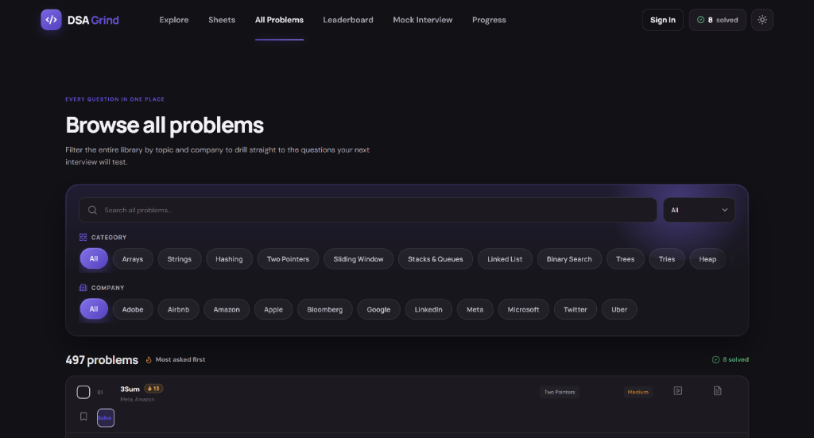

<div align="center">



<h1>⚡ AlgoVault</h1>

### Master DSA. Land the offer.

**14 legendary interview roadmaps · 497 unique problems · 15 patterns · one progress tracker.**

Solve a problem once and it's checked off on *every* sheet that includes it. Learn the pattern once
and hundreds of problems collapse into a handful of ideas you already know.

<br/>

<a href="https://dsa.nextjoblist.com/"></a>
&nbsp;
<a href="#-learn-the-patterns"></a>

<br/><br/>


</div>

<br/>

<table>
<tr>
<td width="25%" align="center"><b>497</b><br/><sub>unique problems</sub></td>
<td width="25%" align="center"><b>14</b><br/><sub>famous roadmaps</sub></td>
<td width="25%" align="center"><b>15</b><br/><sub>core patterns</sub></td>
<td width="25%" align="center"><b>☁️</b><br/><sub>Cloud Sync</sub></td>
</tr>
</table>

<br/>

> [!TIP]
> **New to DSA?** Skip the app for a second and read [**Learn the patterns**](#-learn-the-patterns).
> The overwhelming majority of interview questions are ~15 ideas in disguise. Learn the idea, and the
> mountain of "500 problems" turns into a short list you can actually finish.

<br/>

## Contents

**📚 Learn** &nbsp;·&nbsp; [The patterns](#-learn-the-patterns) &nbsp;·&nbsp; [Code templates](#-code-templates) &nbsp;·&nbsp; [Complexity cheat sheet](#-complexity-cheat-sheet) &nbsp;·&nbsp; [How to practice](#-how-to-actually-practice) &nbsp;·&nbsp; [Study plans](#-study-plans)

**🛠 Use** &nbsp;·&nbsp; [Quick start](#-quick-start) &nbsp;·&nbsp; [Features](#-features) &nbsp;·&nbsp; [The roadmaps](#-the-roadmaps) &nbsp;·&nbsp; [Which sheet first?](#-which-sheet-should-i-start-with) &nbsp;·&nbsp; [How it works](#-how-it-works) &nbsp;·&nbsp; [Add your own sheet](#-add-your-own-sheet)

---

## 🧠 Learn the patterns

Interviewers don't ask 500 different questions. They ask ~15 ideas wearing 500 different costumes.
Each row below is one idea: **the signal that gives it away**, **the move that solves it**, what it
costs, and three real problems from this library to drill it on — ordered by how many of the 14
roadmaps include them.

| Pattern | The signal in the question | The move | Cost | Drill these |
| --- | --- | --- | --- | --- |
| **Hashing** | "have I seen this before", counting, grouping | Trade memory for time — one pass into a dict/set | `O(n)` / `O(n)` | [Two Sum](https://leetcode.com/problems/two-sum/) · [Group Anagrams](https://leetcode.com/problems/group-anagrams/) · [Longest Consecutive Sequence](https://leetcode.com/problems/longest-consecutive-sequence/) |
| **Two Pointers** | Sorted array, pairs/triples summing to a target, palindromes | Start at both ends, move the side that can improve the answer | `O(n)` / `O(1)` | [3Sum](https://leetcode.com/problems/3sum/) · [Container With Most Water](https://leetcode.com/problems/container-with-most-water/) · [Trapping Rain Water](https://leetcode.com/problems/trapping-rain-water/) |
| **Sliding Window** | "longest/shortest **contiguous** subarray or substring such that…" | Expand right, shrink left while the window is invalid | `O(n)` / `O(k)` | [Longest Substring Without Repeating Characters](https://leetcode.com/problems/longest-substring-without-repeating-characters/) · [Longest Repeating Character Replacement](https://leetcode.com/problems/longest-repeating-character-replacement/) · [Minimum Window Substring](https://leetcode.com/problems/minimum-window-substring/) |
| **Fast & Slow Pointers** | Cycles, "find the middle", linked-list structure | Two pointers at 1× and 2× speed | `O(n)` / `O(1)` | [Linked List Cycle](https://leetcode.com/problems/linked-list-cycle/) · [Find the Duplicate Number](https://leetcode.com/problems/find-the-duplicate-number/) · [Palindrome Linked List](https://leetcode.com/problems/palindrome-linked-list/) |
| **Prefix Sum** | Repeated range sums, "subarray summing to k" | Precompute running totals; store seen prefixes in a dict | `O(n)` / `O(n)` | [Subarray Sum Equals K](https://leetcode.com/problems/subarray-sum-equals-k/) · [Product of Array Except Self](https://leetcode.com/problems/product-of-array-except-self/) · [Contiguous Array](https://leetcode.com/problems/contiguous-array/) |
| **Binary Search** | Sorted input — **or** "minimise the maximum / maximise the minimum" | Halve the search space; binary search the *answer*, not just the array | `O(log n)` | [Binary Search](https://leetcode.com/problems/binary-search/) · [Find Minimum in Rotated Sorted Array](https://leetcode.com/problems/find-minimum-in-rotated-sorted-array/) · [Median of Two Sorted Arrays](https://leetcode.com/problems/median-of-two-sorted-arrays/) |
| **Monotonic Stack** | "next greater/smaller element", histogram spans | Keep the stack sorted; pop until the invariant holds | `O(n)` / `O(n)` | [Valid Parentheses](https://leetcode.com/problems/valid-parentheses/) · [Largest Rectangle in Histogram](https://leetcode.com/problems/largest-rectangle-in-histogram/) · [Daily Temperatures](https://leetcode.com/problems/daily-temperatures/) |
| **Intervals** | Meetings, bookings, overlapping ranges | Sort by start; compare `current.start` to `previous.end` | `O(n log n)` | [Merge Intervals](https://leetcode.com/problems/merge-intervals/) · [Insert Interval](https://leetcode.com/problems/insert-interval/) · [Meeting Rooms II](https://leetcode.com/problems/meeting-rooms-ii/) |
| **Heap / Top-K** | "k largest", "k closest", running median, merge k lists | Keep a size-k heap, not a full sort | `O(n log k)` | [Find Median from Data Stream](https://leetcode.com/problems/find-median-from-data-stream/) · [K Closest Points to Origin](https://leetcode.com/problems/k-closest-points-to-origin/) · [Merge k Sorted Lists](https://leetcode.com/problems/merge-k-sorted-lists/) |
| **Tree DFS** | Root-to-leaf paths, subtree answers, "max path" | Recurse, then combine children's returns | `O(n)` / `O(h)` | [Binary Tree Maximum Path Sum](https://leetcode.com/problems/binary-tree-maximum-path-sum/) · [Validate Binary Search Tree](https://leetcode.com/problems/validate-binary-search-tree/) · [Lowest Common Ancestor of a Binary Tree](https://leetcode.com/problems/lowest-common-ancestor-of-a-binary-tree/) |
| **Tree / Graph BFS** | "level by level", **shortest path on unweighted edges** | Queue + visited set, one level per iteration | `O(V+E)` | [Binary Tree Level Order Traversal](https://leetcode.com/problems/binary-tree-level-order-traversal/) · [Binary Tree Right Side View](https://leetcode.com/problems/binary-tree-right-side-view/) · [Rotting Oranges](https://leetcode.com/problems/rotting-oranges/) |
| **Graph DFS / Union-Find** | Connected components, islands, "is this a valid tree" | Flood fill, or union nodes and count roots | `O(V+E)` / `~O(α)` | [Number of Islands](https://leetcode.com/problems/number-of-islands/) · [Clone Graph](https://leetcode.com/problems/clone-graph/) · [Redundant Connection](https://leetcode.com/problems/redundant-connection/) |
| **Topological Sort** | Prerequisites, build order, "can this be finished" | Kahn's BFS on in-degrees — no order means a cycle | `O(V+E)` | [Course Schedule](https://leetcode.com/problems/course-schedule/) · [Course Schedule II](https://leetcode.com/problems/course-schedule-ii/) · [Alien Dictionary](https://leetcode.com/problems/alien-dictionary/) |
| **Backtracking** | "all combinations / permutations / subsets", N-Queens | Choose → recurse → **un**-choose | `O(2ⁿ)`–`O(n!)` | [Combination Sum](https://leetcode.com/problems/combination-sum/) · [Word Search](https://leetcode.com/problems/word-search/) · [N-Queens](https://leetcode.com/problems/n-queens/) |
| **Dynamic Programming** | "how many ways", "min/max cost", overlapping subproblems | Define the state, write the recurrence, memoise then flatten | varies | [Climbing Stairs](https://leetcode.com/problems/climbing-stairs/) · [Coin Change](https://leetcode.com/problems/coin-change/) · [Word Break](https://leetcode.com/problems/word-break/) |
| **Trie** | Prefix lookups, autocomplete, word dictionaries | Char-per-node tree with an `is_word` flag | `O(len)` per op | [Implement Trie](https://leetcode.com/problems/implement-trie-prefix-tree/) · [Design Add and Search Words](https://leetcode.com/problems/design-add-and-search-words-data-structure/) · [Word Search II](https://leetcode.com/problems/word-search-ii/) |

> **How to use this table:** when you're stuck, don't reach for the answer — reach for this column of
> *signals*. Naming the pattern is 80% of the work, and it's the skill the interview is actually testing.

---

## 💻 Code templates

Learn these shapes once and you can write them under pressure. Python, because it's the least noisy
to read — the structure is what matters, not the language.

<details>
<summary><b>Sliding window</b> — longest/shortest contiguous run</summary>

```python
def longest_valid_window(s):
    counts, left, best = {}, 0, 0
    for right, ch in enumerate(s):
        counts[ch] = counts.get(ch, 0) + 1

        while is_invalid(counts):          # shrink until the window is legal again
            counts[s[left]] -= 1
            if counts[s[left]] == 0:
                del counts[s[left]]
            left += 1

        best = max(best, right - left + 1)
    return best
```

Every element enters once and leaves once, so this is `O(n)` even though it's a nested loop.
For a *shortest* window, take the `min` inside the `while` instead.
</details>

<details>
<summary><b>Binary search on the answer</b> — "minimise the maximum"</summary>

```python
def min_feasible(lo, hi, feasible):
    """Smallest x in [lo, hi] with feasible(x) == True.
    Requires feasible to be monotonic: False False False True True True."""
    while lo < hi:
        mid = (lo + hi) // 2
        if feasible(mid):
            hi = mid          # mid might be the answer — keep it
        else:
            lo = mid + 1      # mid is too small — discard it
    return lo
```

This is the trick behind Koko Eating Bananas, Split Array Largest Sum, Capacity To Ship Packages and
Minimum Days to Make Bouquets. The array isn't sorted — **the answer space is.** Write `feasible(x)`
first; the search is always these six lines.
</details>

<details>
<summary><b>BFS on a grid</b> — shortest path, multi-source spread</summary>

```python
from collections import deque

def bfs(grid, starts):
    rows, cols = len(grid), len(grid[0])
    queue = deque((r, c) for r, c in starts)     # seed every source at once
    seen = set(queue)
    steps = 0

    while queue:
        for _ in range(len(queue)):              # one whole level per iteration
            r, c = queue.popleft()
            for dr, dc in ((1, 0), (-1, 0), (0, 1), (0, -1)):
                nr, nc = r + dr, c + dc
                if 0 <= nr < rows and 0 <= nc < cols and (nr, nc) not in seen:
                    seen.add((nr, nc))
                    queue.append((nr, nc))
        steps += 1

    return steps - 1
```

The `for _ in range(len(queue))` is what makes `steps` mean "distance". Seeding multiple starts is
how Rotting Oranges and 01 Matrix become one-pass problems.
</details>

<details>
<summary><b>Backtracking</b> — subsets, permutations, N-Queens</summary>

```python
def solve(candidates):
    results, path = [], []

    def backtrack(start):
        if is_complete(path):
            results.append(path[:])        # copy — path keeps mutating
            return
        for i in range(start, len(candidates)):
            if not is_valid(candidates[i], path):
                continue
            path.append(candidates[i])     # choose
            backtrack(i + 1)               # explore  (i, not i+1, to reuse an element)
            path.pop()                     # un-choose
    backtrack(0)
    return results
```

`path[:]` instead of `path` is the single most common bug here — without the copy every result is
the same (empty) list.
</details>

<details>
<summary><b>Topological sort</b> — Kahn's algorithm</summary>

```python
from collections import deque

def topo_order(n, edges):
    graph = [[] for _ in range(n)]
    indegree = [0] * n
    for prereq, course in edges:
        graph[prereq].append(course)
        indegree[course] += 1

    queue = deque(i for i in range(n) if indegree[i] == 0)
    order = []
    while queue:
        node = queue.popleft()
        order.append(node)
        for nxt in graph[node]:
            indegree[nxt] -= 1
            if indegree[nxt] == 0:
                queue.append(nxt)

    return order if len(order) == n else []   # short order == there's a cycle
```

The length check *is* the cycle detection — that's the whole answer to Course Schedule.
</details>

<details>
<summary><b>Union-Find</b> — connectivity in near-constant time</summary>

```python
class DSU:
    def __init__(self, n):
        self.parent = list(range(n))
        self.size = [1] * n

    def find(self, x):
        while self.parent[x] != x:
            self.parent[x] = self.parent[self.parent[x]]   # path compression
            x = self.parent[x]
        return x

    def union(self, a, b):
        ra, rb = self.find(a), self.find(b)
        if ra == rb:
            return False                                   # already connected: a cycle
        if self.size[ra] < self.size[rb]:                  # union by size
            ra, rb = rb, ra
        self.parent[rb] = ra
        self.size[ra] += self.size[rb]
        return True
```

`union` returning `False` is the cycle check for Redundant Connection and Graph Valid Tree.
</details>

<details>
<summary><b>Monotonic stack</b> — next greater element</summary>

```python
def next_greater(nums):
    result = [-1] * len(nums)
    stack = []                       # holds indices, values decreasing

    for i, num in enumerate(nums):
        while stack and nums[stack[-1]] < num:
            result[stack.pop()] = num
        stack.append(i)

    return result
```

Each index is pushed and popped at most once → `O(n)`. Flip the comparison for next *smaller*;
this same skeleton solves Daily Temperatures, Largest Rectangle and Trapping Rain Water.
</details>

<details>
<summary><b>Top-K with a heap</b></summary>

```python
import heapq

def k_largest(nums, k):
    heap = []                        # min-heap of the k biggest so far
    for num in nums:
        heapq.heappush(heap, num)
        if len(heap) > k:
            heapq.heappop(heap)      # evict the smallest
    return heap
```

`O(n log k)`, not `O(n log n)` — the win is keeping the heap at size `k`. For "k smallest", push
`-num`. Python's `heapq` is a min-heap only.
</details>

<details>
<summary><b>Dynamic programming</b> — memoise, then flatten</summary>

```python
from functools import cache

@cache                               # top-down: write this first, it's easier to get right
def ways(i):
    if i < 0: return 0
    if i == 0: return 1
    return ways(i - 1) + ways(i - 2)

def ways_iterative(n):               # bottom-up: same recurrence, O(1) space
    prev, curr = 1, 1
    for _ in range(n - 1):
        prev, curr = curr, prev + curr
    return curr
```

Always write the recursive version with `@cache` first. Once it's correct, converting to a table is
mechanical — and interviewers accept the memoised version.
</details>

---

## ⏱ Complexity cheat sheet

**What each data structure costs**

| Structure | Access | Search | Insert | Delete | Notes |
| --- | :---: | :---: | :---: | :---: | --- |
| Array / List | `O(1)` | `O(n)` | `O(n)` | `O(n)` | Append is amortised `O(1)` |
| Hash Map / Set | — | `O(1)`* | `O(1)`* | `O(1)`* | *Average; `O(n)` worst case |
| Sorted array | `O(1)` | `O(log n)` | `O(n)` | `O(n)` | Binary search needs the sort |
| Linked List | `O(n)` | `O(n)` | `O(1)` | `O(1)` | Insert/delete only with the node in hand |
| Stack / Queue | — | — | `O(1)` | `O(1)` | |
| Binary Heap | `O(1)` peek | `O(n)` | `O(log n)` | `O(log n)` | Build from a list is `O(n)` |
| Balanced BST | `O(log n)` | `O(log n)` | `O(log n)` | `O(log n)` | Keeps things ordered |
| Trie | — | `O(len)` | `O(len)` | `O(len)` | Independent of how many words |

**What the input size is telling you**

| `n` up to | Complexity you need | Usually means |
| --- | --- | --- |
| 10–12 | `O(n!)` | Permutations, brute-force search |
| 15–25 | `O(2ⁿ)` | Subsets, bitmask DP |
| 100–500 | `O(n³)` | Floyd–Warshall, interval DP |
| ~5,000 | `O(n²)` | Nested loops, most 2-D DP |
| ~10⁶ | `O(n log n)` | Sorting, heap, binary search |
| ~10⁸ | `O(n)` | One pass, sliding window |

> Read the constraints **before** you start coding. `n ≤ 20` is the interviewer telling you to write
> an exponential solution; `n ≤ 10⁶` is them telling you not to.

---

## 🎯 How to actually practice

Grinding problem count is the most common way to waste months. This is the loop that works:

1. **Read the constraints first.** They name the complexity you're aiming for (see the table above).
2. **Say the pattern out loud** before writing anything. "Contiguous + longest → sliding window."
   If you can't name it in 60 seconds, that's the gap — not your coding.
3. **Set a 25-minute timer.** Stuck at zero? Look at the editorial. Struggling but progressing? Keep going.
4. **After reading a solution, close it and re-solve from scratch.** Reading a solution teaches you
   nothing; reproducing it does. This is the step almost everybody skips.
5. **Re-solve it 3 days later, then 10 days later.** Spaced repetition is why bookmarks exist in this app.
6. **Say your approach out loud while you code.** Interviews are graded on communication too, and
   this is the only way to practise it.

**Signals you're doing it right**

| ✅ | ❌ |
| --- | --- |
| You can name the pattern before coding | You recognise the problem because you memorised it |
| You re-solve old problems and they're still easy | You solved 300 problems but freeze on a new Medium |
| You state complexity without being asked | You "get it" while reading, then can't reproduce it |
| You write the brute force, then optimise it | You wait for the optimal to appear fully formed |

---

## 📅 Study plans

| You have | Do this | Target |
| --- | --- | --- |
| **2 weeks** | [Blind 75](content/blind-75.md), Medium only. Skip anything you can already do. | Cover every pattern once |
| **2 months** | [Grind 75](content/grind-75.md) → [NeetCode 150](content/neetcode-150.md). 3–4 problems/day, 1 rest day. | Pattern recognition on sight |
| **4 months** | [NeetCode 150](content/neetcode-150.md) → [Sean Prashad](content/sean-prashad-patterns.md), then a company sheet. | Comfortable with Hards |
| **6+ months from scratch** | [Striver A2Z](content/striver-a2z.md) or [Love Babbar 450](content/love-babbar-450.md), in order. | Full coverage, no gaps |
| **1 week before the interview** | Your bookmarks + the 🔥10+ problems in All Problems. Nothing new. | Sharpness, not breadth |

**The last week rule:** don't learn new patterns. Re-solve what you already know until it's automatic.
New material this late only costs you confidence.

---

## 🚀 Quick start

**Just want to use it?** → **[dsa.nextjoblist.com](https://dsa.nextjoblist.com/)** — nothing to install.

Run it locally:

```bash
git clone https://github.com/sumitsingh4411/faang.git
cd faang
npm install
npm run dev
```

Progress syncs seamlessly to the cloud via Firebase Authentication, or falls back to your browser's localStorage if you prefer to use it anonymously.

---

## ✨ Features

- 🔄 **Cross-sheet progress sync** — every problem is identified by its LeetCode slug, not the sheet it lives in. Check off *Two Sum* on Blind 75 and it's instantly complete on NeetCode, Grind 75, and everywhere else it appears.
- 🗂 **All Problems browser** — one deduplicated library of all 497 questions, filterable by **category** (Arrays, DP, Graphs…) and **company** (Amazon, Google, Meta…).
- 🔥 **Most-asked first** — problems are ranked by how many roadmaps include them. *3Sum*, *Course Schedule* and *Implement Trie* each appear on 13 of the 14 sheets, so they sit at the top with a 🔥13 badge. Grind the questions that actually get asked.
- 📊 **Progress center** — completion, difficulty breakdown, topic mastery, weekly activity, streaks, per-sheet progress.
- 🎯 **Daily challenge**, bookmarks, search, difficulty filters.
- 🏆 **Global Leaderboard** — compete with other developers worldwide and track top performers.
- ⏱️ **Mock Interview Mode** — simulate 45-minute timed interview sessions with company-specific problem sets.
- ☁️ **Cloud Sync & Auth** — sign in with Google to securely sync your progress across all your devices.
- 🌗 **Light & dark themes**, fully responsive.

<div align="center">

</div>

---

## 🗺 The roadmaps

2,295 entries across 14 sheets — 497 unique problems after deduplication. Every sheet holds its full
roster: Blind 75 really is 75, NeetCode 150 really is 150.

| Sheet | Curator | Problems | Suggested pace |
| --- | --- | :---: | --- |
| **Blind 75** ⭐ | Blind 75 | 75 | 6–8 weeks |
| **Grind 75** ⭐ | Tech Interview Handbook | 75 | 8–10 weeks |
| **Sean Prashad Patterns** ⭐ | Sean Prashad | 171 | 8–10 weeks |
| **Striver A2Z DSA Sheet** ⭐ | Take U Forward | 298 | 16–20 weeks |
| NeetCode 150 | NeetCode | 150 | 10–12 weeks |
| NeetCode 250 | NeetCode | 250 | 14–18 weeks |
| Grind 169 | Tech Interview Handbook | 169 | 12–16 weeks |
| Striver SDE Sheet | Take U Forward | 182 | 8–12 weeks |
| Top Interview 150 | LeetCode | 150 | 10–14 weeks |
| Love Babbar 450 | CodeHelp | 450 | 20–24 weeks |
| AlgoMap 100 | AlgoMap | 100 | 6–8 weeks |
| Amazon Top Questions | AlgoVault | 75 | 6–8 weeks |
| Google Top Questions | AlgoVault | 75 | 6–8 weeks |
| Meta Top Questions | AlgoVault | 75 | 5–7 weeks |

> ⭐ = featured. Every problem links straight to LeetCode, and solving it once checks it off on every
> sheet it appears in.

---

## 🧭 Which sheet should I start with?

| Your situation | Start here |
| --- | --- |
| 🚨 Interview in ~2 months | **Blind 75** or **Grind 75** — the highest-value questions, nothing else |
| 🧠 Want to *recognise patterns*, not memorise answers | **Sean Prashad Patterns** — organised by technique |
| 🌱 Starting DSA from scratch | **Striver A2Z** or **Love Babbar 450** — basics through advanced, in order |
| 🎯 Targeting one company | **Amazon / Google / Meta Top Questions**, or All Problems → company filter |
| 🏋️ Finished a starter list, want depth | **NeetCode 250** or **Grind 169** |

**Pro tip:** open **All Problems → Most asked first**. Anything with a 🔥3+ badge appears on three or
more famous roadmaps — those are the classics you should be able to solve in your sleep.

---

## 🧩 How it works

```
content/*.md ──▶ parseSheets.ts ──▶ canonical problem IDs ──▶ React UI
 (frontmatter        (build-time         lc:two-sum              (progress in
  + tables)           parser)         shared across sheets        localStorage)
```

- Every Markdown file in `content/` becomes a sheet automatically — no React changes needed.
- Problems are keyed by their **LeetCode URL slug** (`lc:two-sum`), which is what makes cross-sheet
  sync and deduplication work.
- Categories are normalised ("Arrays & Hashing" → *Arrays*) so filters stay clean across sheets that
  label things differently.

## ✍️ Add your own sheet

Drop a Markdown file into `content/` — frontmatter plus tables, done:

```md
---
title: My Sheet
slug: my-sheet
description: A short description.
author: Your Name
icon: code          # target | layers | code | briefcase
accent: violet      # violet | blue | green | orange
estimated: 4–6 weeks
featured: false
---

## Arrays

| Problem | Difficulty | LeetCode | Pattern | Companies |
| --- | --- | --- | --- | --- |
| Two Sum | Easy | https://leetcode.com/problems/two-sum/ | Hash Map | Amazon, Google |
```

The `Pattern` column feeds the category filter and the topic chips on each roadmap card, so use the
real technique name — it's what makes the library searchable by idea rather than by title.

---

## 🤝 Contributing

AlgoVault is **open-source and community-driven** — and most contributions are plain Markdown, no React
required. Spotted a dead LeetCode link, a wrong difficulty, or a missing problem? That's a real fix.

- 🐛 [**Open an issue**](https://github.com/sumitsingh4411/faang/issues/new) — reporting a bad link counts.
- 🔀 [**Read the contributor guide**](CONTRIBUTING.md) — how to add sheets, fix tags, and open a PR.
- ⭐ **Star the repo** if it helped — it's how the next person finds it.

Every problem links straight to LeetCode, every sheet is one Markdown file, and the app picks up new
files automatically. It's about as low-friction as open source gets.

---

<div align="center">

### Build consistency. Learn patterns. Get the offer.

<a href="https://dsa.nextjoblist.com/"></a>

If AlgoVault helped you prep, **give it a ⭐** — it's the whole reason someone else finds it next.

<sub>MIT licensed · built with React + TypeScript + Vite + Firebase</sub>

</div>
